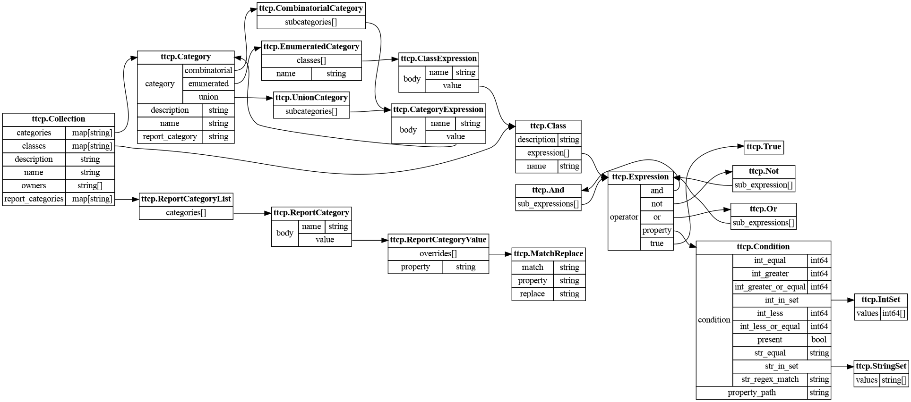

# Package ttcp

TTCP statement's syntactic structures.

A user guide can be found
at src/config-internal/ttcp/docs/syntax.md

## Entities relation maps

## Contents

[TOC]

### ttcp.And

Defines a logical test over a device that
is true only if all the subExpression are
true.

|Field||type|Description|
|-----|----|----|-----------|
|sub_expressions||Expression[]||

### ttcp.Category

Category denotes a set of behavioral
variants that are related to a class of
stimulations.

|Field||type|Description|
|-----|----|----|-----------|
|category||OneOf||
||combinatorial|CombinatorialCategory|The category is defined by combination of other categories.|
||enumerated|EnumeratedCategory|The category is defined by an enumeration of classes.|
||union|UnionCategory|The category is defined by an union of categories.|
|description||string|Description of the semantics of the category|
|name||string|User friedly string that represents the category Constraint: Name is required and needs to satisfy the regex: '^[a-z][a-z0-9_]*(/[a-z][a-z0-9_]*)*$' max length is 64|
|report_category||string|Eqc reporting categories.|

### ttcp.CategoryExpression

CategoryExpression denotes a category
via referencing a predefined expresion
by name or defining it explicitly.

|Field||type|Description|
|-----|----|----|-----------|
|body||OneOf||
||name|string|Name of the predefined category.|
||value|Category|Explicit category value.|

### ttcp.Class

Class purpose is to identify a set of
devices sharing an identical behavior
resulting from the stimulation of a
specific kind. A device is amember of the
Class if it satisfies the expression of
the Class.

|Field||type|Description|
|-----|----|----|-----------|
|description||string|Description of the semantics of the class.|
|expression||Expression||
|name||string|User friedly string that represents the class Constraint: Name is required and needs to satisfy the regex: '^[a-z][a-z0-9_]*(/[a-z][a-z0-9_]*)*$' max length is 64|

### ttcp.ClassExpression

CategoryExpression allows to define a
give a ttcp class by referencing a
predefined expresion by name or an
explicit value.

|Field||type|Description|
|-----|----|----|-----------|
|body||OneOf||
||name|string|The class is defined by the name of a predefined class|
||value|Class|The class is defined by a class value|

### ttcp.Collection

Collection is a dataset of property
categories and classes. The categories
andclasses of a collection can be
referenced in ttcp expressions by name.

|Field||type|Description|
|-----|----|----|-----------|
|categories||map[string]Category|Index of categories.|
|classes||map[string]Class|Index of classes.|
|description||string|Description of the collection. Constraint: use only printable ascii characters|
|name||string|Name of the collection. Constraint: The name needs to satisfy the regex '^[a-z][a-z0-9_]*(/[a-z][a-z0-9_]*)*$', max length is 64|
|owners||string[]|Who maintains this collection.|
|report_categories||map[string]ReportCategoryList|Index of reporting categories for readable eqc names.|

### ttcp.CombinatorialCategory

CombinatorialCategory is a structure to
create higher level categories out of
more elementary ones. This is used when a
behavior is the result of the interaction
of more elementary behaviors

A CombinatorialCategory is equivalent to
an EnumeratedCategory, where each
combination of classes of the
subcategories is transformed into a
single class in the EnumeratedCategory by
conjuncting them

|Field||type|Description|
|-----|----|----|-----------|
|subcategories||CategoryExpression[]|List of the categories to combine.|

### ttcp.Condition

Defines a test over a specific property
of a device

|Field||type|Description|
|-----|----|----|-----------|
|condition||OneOf|The condition the property needs to statisfy.|
||int_equal|int64|The property is an integer equal to the value.|
||int_greater|int64|The property is an integer greater than the value.|
||int_greater_or_equal|int64|The property is an integer greater or equal than the value.|
||int_in_set|IntSet|The property is an integer equal to one of the values.|
||int_less|int64|The property is an integer lesser than the value.|
||int_less_or_equal|int64|The property is an integer lesser or equal  to the value.|
||present|bool|The property is present.|
||str_equal|string|The property has a string representation  equal to the value.|
||str_in_set|StringSet|The property has a string representation equal to one of the values.|
||str_regex_match|string|The property has a string regex match   with a value.|
|property_path||string|The path of the property the condition applies to.|

### ttcp.EnumeratedCategory

EnumeratedCategory defines the different
class of behavior bydirectly enumerating
each property class that identifies the
behavior.

|Field||type|Description|
|-----|----|----|-----------|
|classes||ClassExpression[]|List of the classes constituting the category.|
|name||string|User friedly string that represents the category. Constraint: Name is required and needs to satisfy the regex: '^[a-z][a-z0-9_]*(/[a-z][a-z0-9_]*)*$' max length  is 64|

### ttcp.Expression

An Expression is a logical test over the
properties of a device.

|Field||type|Description|
|-----|----|----|-----------|
|operator||OneOf||
||and|And||
||not|Not||
||or|Or||
||property|Condition||
||true|True||

### ttcp.IntSet

List of integers.

|Field||type|Description|
|-----|----|----|-----------|
|values||int64[]||

### ttcp.MatchReplace

|Field||type|Description|
|-----|----|----|-----------|
|match||string||
|property||string||
|replace||string||

### ttcp.Not

Defines a logical test over the
properties of a device that is true only
if the subexpressions is false.

|Field||type|Description|
|-----|----|----|-----------|
|sub_expression||Expression||

### ttcp.Or

Defines a logical test over the
properties of a device that is true only
if at least one subexpressions is true.

|Field||type|Description|
|-----|----|----|-----------|
|sub_expressions||Expression[]||

### ttcp.ReportCategory

|Field||type|Description|
|-----|----|----|-----------|
|body||OneOf||
||name|string|Name of the predefined report category.|
||value|ReportCategoryValue|Explicit report category value.|

### ttcp.ReportCategoryList

|Field||type|Description|
|-----|----|----|-----------|
|categories||ReportCategory[]||

### ttcp.ReportCategoryValue

|Field||type|Description|
|-----|----|----|-----------|
|overrides||MatchReplace[]||
|property||string||

### ttcp.StringSet

List of strings.

|Field||type|Description|
|-----|----|----|-----------|
|values||string[]||

### ttcp.True

Defines a logical test that is always
true.

|Field||type|Description|
|-----|----|----|-----------|

### ttcp.UnionCategory

The union category is a structure to
create sparse matrixes out of more
elementary categories. This is used
instead of a CombinatorialCategory when
it would create too many of the
combinations would not have an impact on
the test's behavior

|Field||type|Description|
|-----|----|----|-----------|
|subcategories||CategoryExpression[]|List of the categories constituting the category.|

